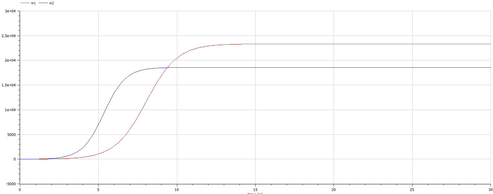

---
## Front matter
lang: ru-RU
title: Lab6 Задача об эпидемии 
author: Поздняков Данила Романович
institute: RUDN University, Moscow, Russian Federation
date: 2022, 25 February

## Formatting
mainfont: PT Serif 
romanfont: PT Serif 
sansfont: PT Sans 
monofont: PT Mono
toc: false
slide_level: 2
theme: metropolis
header-includes: 
 - \metroset{progressbar=frametitle,sectionpage=progressbar,numbering=fraction}
 - '\makeatletter'
 - '\beamer@ignorenonframefalse'
 - '\makeatother'
 - \usepackage[T2A]{fontenc}
aspectratio: 43
section-titles: true
---

# Цель работы

Постройте графики изменения числа особей в каждой из трех групп.
Рассмотрите, как будет протекать эпидемия в 2ух случаях.

# Выведение формул

{width=100%}

# Написание кода в Open Modelica

{width=100%}

# Построение графиков в Open Modelica

{width=100%}

# Построение графиков в Open Modelica

{width=100%}

